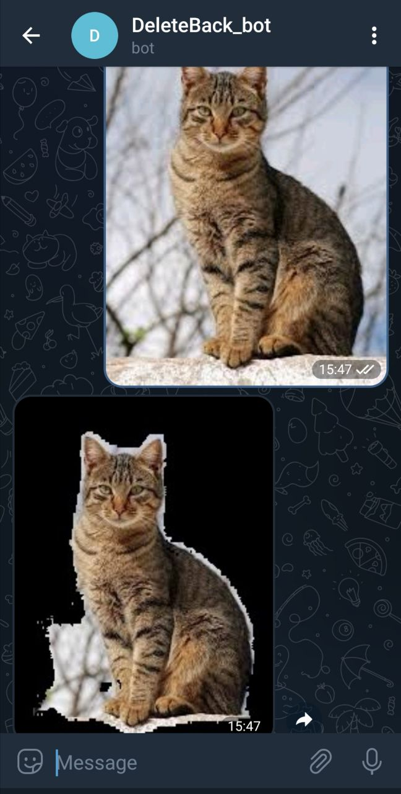

# DeleteBack_bot
Telegram bot for background removal from cats and dog pictures.
## Stack
-Tensorflow

-Opencv

-Telebot

-Albumentations

## Description of the machine learning method

Image segmentation was used as a method to remove the background. That is, for each image, a mask was created, consisting of the values of the classes to which each image pixel belongs.

To solve the problem of image segmentation, a neural network built on the U-Net architecture was used. The pre-trained VGG16 model was used as the Encoder.

The The Oxford-IIIT Pet Dataset was used to train the model. Dataset is accessible by link: https://www.kaggle.com/datasets/julinmaloof/the-oxfordiiit-pet-dataset?select=images. 
This dataset consists of images of pets of various breeds, as well as masks for each image, where each pixel is assigned one of 3 classes: 1-pet, 2-border between the pet and the background, 3-background.

## Example of bot's working

